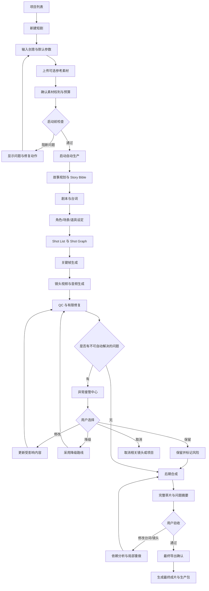
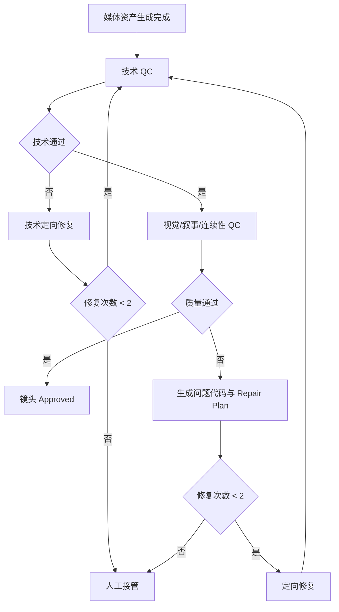
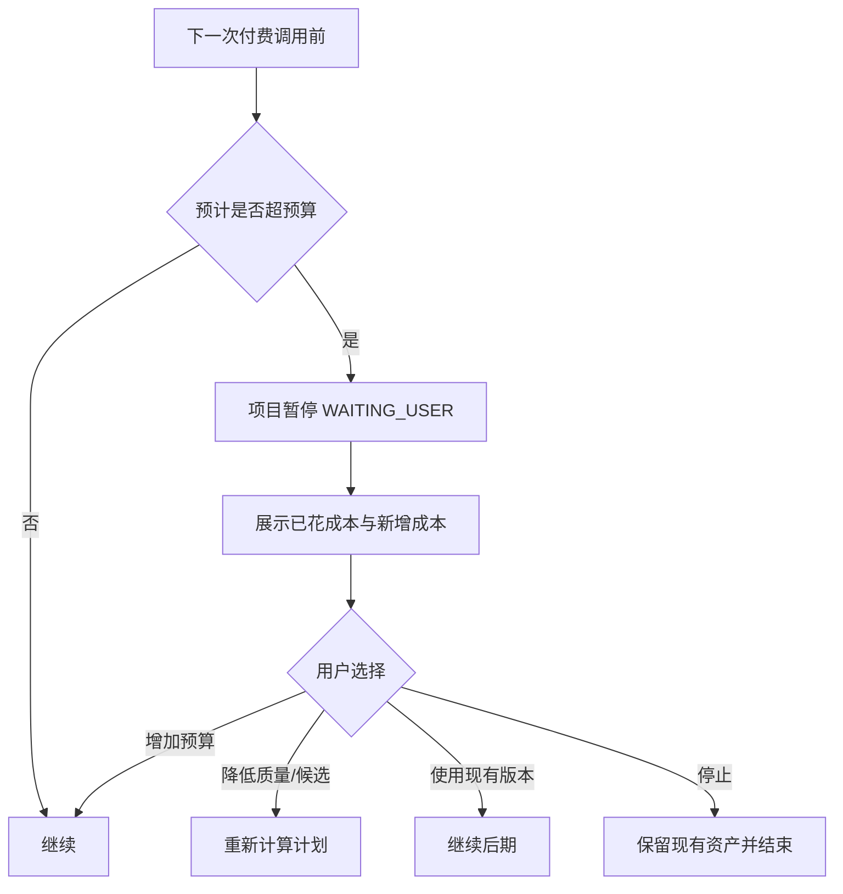
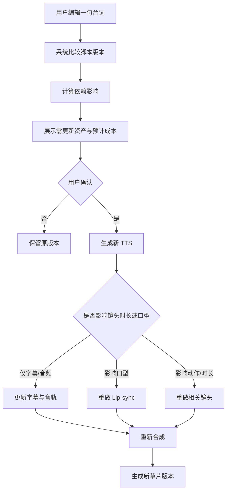
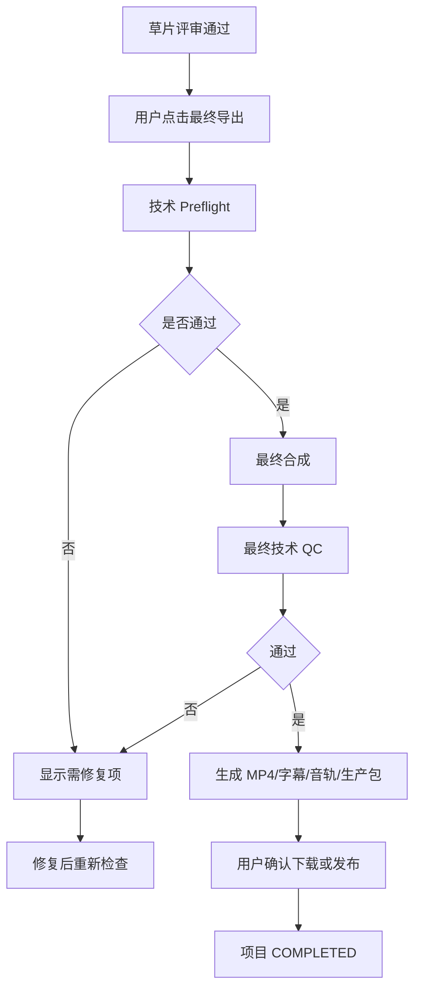

# 04_USER_FLOWS.md — AI 短剧制作 Agent 用户流程

> **文档状态：Draft for Product Review**  
> 本文件描述 MVP 的用户操作路径、系统自动行为、异常介入和状态变化。默认原则是：用户提供目标，系统自动生产，只有阻断性异常和最终发布需要用户介入。

---

## 0. 文档控制

| 字段 | 内容 |
|---|---|
| 项目名称 | AI 短剧制作 Agent |
| 文档版本 | v0.1 |
| 状态 | Draft for Review |
| 上位文件 | `INTENT.md`、`02_DECISIONS.md`、`03_PRODUCT_SPEC.md` |
| 基准样片 | 《门外的人》 |
| 更新时间 | 2026-08-29 |

---

# 1. 流程设计原则

1. **目标输入优先**：用户先描述想做什么，而不是先配置模型。
2. **默认自动推进**：内部阶段不要求用户持续点击“下一步”。
3. **异常才升级**：只有歧义、授权、预算、修复失败等阻断问题才中断。
4. **随时可见**：用户可以看到当前阶段、已完成资产和下一步。
5. **随时可控**：用户可以暂停、取消、编辑或锁定内容。
6. **局部影响**：修改只触发真正依赖它的任务。
7. **最终由人发布**：系统可以生成和导出，但不能未经确认自动发布。
8. **Evidence 可追溯**：用户可以理解系统做过什么，而不是面对黑箱。

---

# 2. 参与者

| 参与者 | 职责 |
|---|---|
| Creator | 输入创作目标、处理异常、验收成片 |
| Web App | 展示项目、状态、预览和可执行操作 |
| Production Orchestrator | 推进项目工作流、控制状态和预算 |
| Creative Nodes | 故事、剧本、分镜、连续性和修复决策 |
| Provider Adapters | 调用图片、视频、语音、口型等外部能力 |
| Media Worker | FFmpeg 检查、合成、字幕和导出 |
| QC System | 技术、视觉、叙事和连续性检查 |
| Evidence System | 保存日志、状态、产物、成本和测试证据 |

---

# 3. 主流程：一句话创意到完整草片



---

# 4. 主流程详细步骤

## Step 1：进入项目列表

### 用户看到

- 已有项目
- 项目状态
- 最近更新时间
- 已花成本
- 成片缩略图
- “新建短剧”按钮

### 用户操作

点击“新建短剧”。

### 系统行为

创建临时 Draft，尚不调用任何付费模型。

---

## Step 2：输入创作目标

### 页面

`/projects/new`

### 必填输入

- 一句话创意、故事大纲、小说片段或完整剧本
- 项目名称，允许自动生成
- 目标时长，默认 60 秒
- 题材，允许自动判断

### 默认值

- 9:16
- 720P
- 30fps
- 中文普通话
- 最多 2 个主要角色
- 最多 2 个核心场景
- 自动运行到完整草片
- 每镜头最多修复 2 次

### 高级选项

- 视觉风格
- 目标受众
- 节奏
- 禁止项
- 质量档位
- 成本上限
- 是否优先降低成本或提高质量

### 设计要求

用户不需要知道使用哪个视频模型。

---

## Step 3：上传参考素材

### 可选内容

- 角色图片
- 场景图片
- 风格图片
- 声音样本
- 动作视频

### 系统行为

- 为素材生成 Asset ID。
- 识别素材类型。
- 提示用户选择用途。
- 对真人素材显示权利确认。
- 不自动将素材用于未声明用途。

### 异常

上传失败时，只重试上传，不影响已填写的项目 Brief。

---

## Step 4：启动确认

### 用户看到

一张简短的启动卡：

```text
预计成片：60–90 秒
预计角色：2
预计场景：1–2
默认输出：9:16 / 720P / 30fps
自动模式：运行至完整草片
自动修复上限：每镜头 2 次
预算上限：¥XXX
素材授权：已确认 / 待确认
```

### 用户操作

点击“开始制作”。

### 系统行为

进入 PREFLIGHT，不立即发起付费生成。

---

## Step 5：Preflight

### 系统检查

- 输入是否足够
- 角色和场景规模是否超出 MVP
- 参考素材授权
- Provider 和密钥配置
- 数据库、Temporal、存储和媒体 Worker
- 预算
- 文件格式
- 目标时长合理性

### 通过

项目进入 READY，然后自动进入 RUNNING。

### 不通过

项目进入 WAITING_USER，并只展示阻断问题。

---

## Step 6：自动故事与剧本生产

### 系统自动执行

1. 解析输入。
2. 生成故事节拍。
3. 创建 Story Bible。
4. 生成结构化剧本。
5. 检查角色数、场景数和预计时长。
6. 必要时进行一次内部修正。
7. 保存版本和 Evidence。

### 用户体验

项目总览显示：

```text
正在形成故事结构
已完成：创作 Brief
当前：剧本
下一步：角色与场景设定
```

用户可以查看结果，但默认不需要确认才能继续。

### 阻断条件

只有以下情况需要用户介入：

- 输入有两种完全不同且无法合理选择的解释。
- 内容触发安全限制。
- 故事必须超过已批准范围才能成立。
- 用户参考素材与文字要求明显冲突。

---

## Step 7：自动建立 Bibles

### 系统自动执行

- 建立两个以内的主要角色。
- 生成角色固定特征和 Look。
- 建立 Location Bible。
- 建立关键道具。
- 创建连续性初始状态。
- 生成或选择参考图。

### 处理原则

- 已提供参考图时优先使用。
- 未提供时由系统生成。
- 首版不训练 LoRA。
- 角色、场景或道具通过内部检查后可以被系统锁定。

### 可选用户操作

用户可主动暂停并编辑设定，但不是默认必经步骤。

---

## Step 8：自动拆分镜头

### 系统自动执行

- 将剧本拆成 12–24 个镜头。
- 为每个镜头生成 ShotSpec。
- 建立 Shot Graph。
- 标出可并行任务。
- 选择生成路线。
- 估算候选、修复和成本。
- 检查总时长。

### 用户看到

分镜板逐步出现，而不是等待全部完成后一次显示。

---

## Step 9：关键帧生成

### 系统策略

优先为以下镜头生成关键帧：

- 场景建立镜头
- 角色首次出现
- Look 首次出现
- 情绪特写
- 道具特写
- 首尾帧依赖镜头
- 高成本镜头

### 自动检查

- 角色身份
- 服装
- 场景
- 道具
- 构图
- 站位
- 光线

### 失败

关键帧失败只影响对应镜头，不停止其他无依赖镜头。

---

## Step 10：视频、配音和音效生成

### 系统自动执行

- 根据 Shot Route 调用相应 Provider。
- 在依赖允许时并行生成。
- 对白生成与台词版本绑定。
- 原生音频不可用时，调用独立 TTS / Lip-sync 路线。
- 保存每个候选及元数据。

### 用户看到

- 已完成镜头数
- 当前生成镜头
- 已花成本
- 失败或等待数量
- 预计剩余阶段

不显示虚假的精确完成时间。

---

## Step 11：QC 与有限修复



### 系统行为

- 不仅给分数，还必须给具体问题。
- 修复尽量保持已通过变量。
- 不允许用新任务绕过修复次数。
- 两次失败后进入异常中心。

---

# 5. 异常接管流程

## 5.1 异常中心入口

项目进入 `WAITING_USER` 时，用户收到一张可执行问题卡，而不是原始堆栈。

### 问题卡结构

```text
问题：女主在镜头 SC01_SH08 中身份漂移
已尝试：
1. 增强角色参考图
2. 更换为参考生视频路线

当前成本：¥X
预计继续成本：¥Y

建议：
A. 改用反应镜头并减少动作
B. 选择现有候选 2
C. 上传新的角色参考图
D. 保留当前版本并标记风险
E. 删除该镜头并自动调整时间线
```

---

## 5.2 预算超限



### 规则

未经明确批准，不允许自动增加预算。

---

## 5.3 Provider 不可用

### 可恢复错误

例如：

- 短时限流
- 网络超时
- 暂时服务错误

系统按策略重试，并保持幂等。

### 不可恢复错误

例如：

- 模型下线
- 输入永久不受支持
- 授权失败
- 账户无余额

系统应：

1. 停止相关任务。
2. 保留已完成资产。
3. 展示替代 Provider 是否等价。
4. 需要切换能力路线时请求用户确认。
5. 不得静默降级。

---

## 5.4 服务或 Worker 中断

### 用户体验

项目显示“恢复中”，而不是重新开始。

### 系统行为

- 从 Temporal 和数据库恢复状态。
- 查询已有 Provider Job。
- 对已提交但结果未知的任务进行幂等对账。
- 不重复创建付费任务。
- 继续尚未完成的依赖链。

---

## 5.5 内容和权利风险

### 触发

- 真人肖像或声音未确认授权
- 敏感或受限制内容
- 来源不明的影视素材
- 用户要求移除第三方水印

### 结果

- 停止相关处理。
- 说明阻断原因。
- 允许用户删除或替换素材。
- 不提供绕过方式。

---

# 6. 完整草片评审流程

## 6.1 草片页面

用户看到：

- 完整视频播放器
- 镜头时间线
- 字幕
- 总成本
- 总生成时长
- 通过、降级和异常镜头数量
- 问题摘要
- 导出按钮
- 修改入口

## 6.2 默认评审方式

用户先观看完整草片，再决定是否修改。

系统不要求先逐镜头看完才能播放。

## 6.3 镜头跳转

点击时间线中的镜头，可查看：

- ShotSpec
- 选中资产
- 其他候选
- QC 报告
- 生成路线
- 成本
- 重新生成
- 替换

---

# 7. 修改一句台词流程



### 约束

- 不重做无关场景。
- 原台词和资产版本保留。
- 用户能看到预计新增成本。
- 新草片形成独立 Timeline 版本。

---

# 8. 替换一个镜头流程

## 用户操作

1. 在时间线点击目标镜头。
2. 查看候选。
3. 选择另一个候选或发起局部重做。
4. 预览入点、出点和音频影响。
5. 确认替换。

## 系统行为

- 创建新的 Timeline 版本。
- 只重合成受影响区段或最终文件。
- 不改变其他镜头的选中资产。
- 重新运行相关技术 QC。
- 记录替换 Evidence。

---

# 9. 主动暂停、恢复与取消

## 9.1 暂停

用户点击暂停后：

- 不再启动新的付费任务。
- 已经提交且无法取消的任务继续对账。
- 已完成资产保存。
- 项目进入 PAUSED。

## 9.2 恢复

恢复前系统重新执行：

- Provider 可用性检查
- 预算检查
- 状态对账
- 依赖检查

然后从最近有效状态继续。

## 9.3 取消

用户可以：

- 取消整个项目
- 取消单个镜头的未开始任务
- 保留或删除已生成资产

已发生的真实费用不能被假设为可退回。

---

# 10. 最终导出流程



### 最终交付

- MP4
- 字幕文件
- 独立音轨
- 镜头素材
- 结构化项目数据
- QC 报告
- 成本报告
- Evidence Manifest

---

# 11. 从不同输入开始的流程差异

## 11.1 一句话创意

需要完整执行：

```text
Idea → Beat Sheet → Story Bible → Screenplay
```

## 11.2 故事大纲

系统保留原大纲事实，重点补充：

- 钩子
- 节奏
- 场景
- 台词
- 镜头

## 11.3 小说片段

系统先识别：

- 叙事视角
- 可见动作
- 内心描写
- 时间跨度
- 角色数量

无法直接视觉化的内容必须转成动作、台词或旁白，不得照搬为视频 Prompt。

## 11.4 完整剧本

系统优先保留用户剧本，只进行：

- 结构校验
- 时长适配
- 角色和场景规模检查
- Shot 拆分
- 必要的风险提示

未经用户允许不得大幅重写。

---

# 12. 页面与流程映射

| 页面 | 主要目的 | 默认操作 |
|---|---|---|
| 项目列表 | 查看所有项目和状态 | 新建、继续、复制 |
| 新建短剧 | 输入目标和素材 | 开始制作 |
| 项目总览 | 查看自动生产进度 | 暂停、查看异常 |
| 故事与剧本 | 查看和编辑内容 | 保存新版本 |
| 设定库 | 管理角色、场景、道具 | 锁定、替换参考 |
| 分镜板 | 查看 Shot 与状态 | 打开镜头详情 |
| 异常中心 | 处理阻断问题 | 选择修复、降级或停止 |
| 草片评审 | 完整观看和定位问题 | 替换、修改、导出 |
| 成本与 Evidence | 查看调用、成本和证据 | 筛选、导出报告 |
| 导出 | 确认最终规格 | 生成生产包 |

---

# 13. 用户提示原则

## 应该说

- “镜头 8 的角色身份连续两次未通过，系统已停止自动修复。”
- “继续使用高质量路线预计增加 ¥12。”
- “修改这句台词将更新配音、字幕和镜头 7 的口型。”
- “视频 Provider 暂时不可用，已有 13 个镜头不会重新生成。”

## 不应该说

- “Agent 正在思考。”
- “发生未知错误，请重试。”
- “VLM 得分 83，所以视频很好。”
- “为了最佳效果，系统已自动增加预算。”
- “工作流失败，已从头重新运行。”

---

# 14. 流程验收场景

## UF-ACC-001 常规自动流程

给定一句话创意和有效预算，用户在启动后无需逐步确认即可得到完整草片。

## UF-ACC-002 单镜头失败

一个镜头失败不会阻塞无依赖镜头，也不会触发整片重新生成。

## UF-ACC-003 修复上限

同一镜头达到两次修复后，必须进入异常接管。

## UF-ACC-004 预算阻断

预计超预算时，系统在付费调用前暂停。

## UF-ACC-005 中断恢复

服务恢复后从最近状态继续，已完成资产不重复生成。

## UF-ACC-006 台词局部修改

修改一句台词只更新依赖资产。

## UF-ACC-007 镜头替换

替换一个镜头后可以重新导出，其他镜头保持不变。

## UF-ACC-008 最终发布

系统不会未经用户确认自动发布内容。

---

# 15. 待产品评审项

本文件建议 Product Owner 重点确认：

1. 默认启动确认是否足够简洁。
2. 是否需要在完整草片前增加可选而非强制的分镜预览。
3. 异常问题卡的决策选项是否足够。
4. 台词修改是否需要提供“仅改字幕、不重做口型”的快捷降级选项。
5. 最终生产包是否需要默认包含全部候选，还是只包含选中资产。
6. 项目复制是否进入 MVP 第一版，还是 Mock 里程碑后补充。
